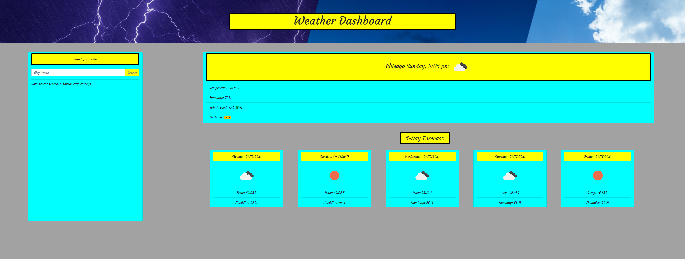

## Live Deploy
https://vygoth.github.io/Weather-Dashboard/

# Weather Dashboard

# Contact
Vygoth
JeremyJoanet@Protonmail.com

## Description
A fun little application that was built using a ton of if statements in conjunction with the open weather API. This application was built with bootstrap.

This application allows users to enter a city in order to run an API query and receive not only that day's weather, but also a 5 day forecast for the selected city. Previous city searches are then saved in the left column for future reference. This application utilizes a geolocator to find the users location in order to auto-generate their local city weather.

Neon colors are fun.

## Table of Contents
- [Usage](#Usage)
- [Credits](#Credits)
- [Screenshot](#Screenshot)

## Usage
This application has a live deploy link, which can be found at the top of this README.

## Credits
Zach Duty, Matt Reisdorf

## Screenshot

